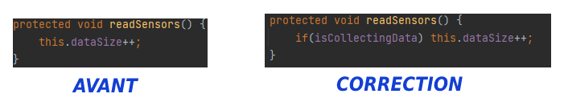

# Exercice Balises / Satellites
Valentin Gallo | Pierre Le Brun (Master TIIL-A)

## Correction du bug :

Le bug  

## Ameliorations réalisées :

- ### Les balises collectaient trop de données

Nous avons remarqué que les balises récupéraient des données à chaque
tick même quand elle occupé à remonter à la surface (donc 350 dataSize /300 memorySize était possibles)

- ### Ajout d'un indicateur de progression sur les balises

Permet d'afficher le pourcentage de données collectées par une balise :

- 3
- 4
- 5

## Diagramme UML :
A regénérer !
