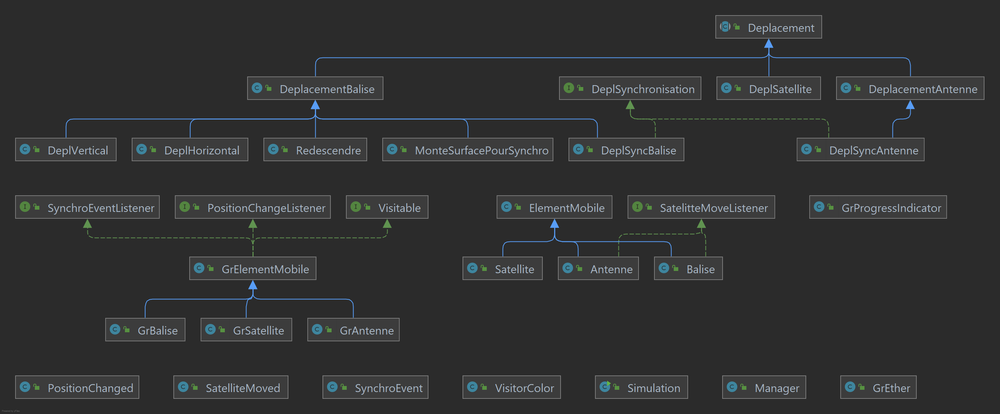

# Exercice Balises / Satellites
Valentin Gallo | Pierre Le Brun (Master TIIL-A)

## Correction du bogue :

### Problème constaté

Le problème qui intervient suite à l'exécution du programme concerne les balises qui peuvent
rester bloquées à la surface.

La balise effectue une réinitialisation de ses données pendant qu'elle remonte à la surface et redémarre la collecte.
Elle reste donc bloqué

### Correctif

Nous avons ajouté un boolean qui permet de savoir si la balise collecte des données.

```java
boolean isCollectingData = true;
```
_Désormais lors des **tick()** d'une balise on vérifie si le boolean est à true._

Le boolean est défini à **faux** lorsque la mémoire de la balise est remplie.

```java
if(this.memoryFull()) {
    ...
    this.isCollectingData = false;
    ...
}
```

Le boolean est défini à **vrai** lorsque la balise est redescendue et est prête à collecter.

```java
public void bouge(Balise target) {
    Point p = target.getPosition();
    int y = p.y;
    if (y < this.profondeur) {
        y += 3;
        if (y > this.profondeur) y = this.profondeur;
        target.setPosition(new Point(p.x, y));
    }  else {
        target.isCollectingData =true;
        target.setDeplacement(next);
    }
}
```

## Ameliorations réalisées :

- ### Les balises collectaient trop de données

Nous avons remarqué que les balises récupéraient des données à chaque
tick même quand elle occupé à remonter à la surface (donc 350 dataSize /300 memorySize était possibles)
```java
public void tick() {
    if (isCollectingData) {
        this.readSensors();
        if(this.memoryFull()) {
            Deplacement redescendre = new Redescendre(this.deplacement(), this.profondeur());
            Deplacement deplSynchro = new DeplSynchronisation(redescendre);
            Deplacement nextDepl = new MonteSurfacePourSynchro(deplSynchro);
            this.setDeplacement(nextDepl);
            this.isCollectingData = false;
        }
    }
    super.tick();
}
```
_Corrigé en appelant la méthode readSensors() vérifiant si la balise collecte des données_

- ### Ajout d'indicateurs de progression

Permet d'afficher le pourcentage de données collectées sur la mémoire totale d'un **elementMobile**.


_Implémenté pour les balises, les satellites et les antennes._

- ### Ajout d'antennes

Permet de récupérer les données d'un satellite lorsque celui-ci passe au-dessus.


_Elle hérite d'un **elementMobile** et possède une taille mémoire, tout comme un satellite ou une balise._

- ### Ajout de l'envoi partiel de données

Désormais un **elementMobile** à la possibilité d'envoyer une partie de ses données si le receveur n'a pas
la capacité de tout recevoir.

```java
protected void sendData(ElementMobile element) {
    int availableData = element.getAvailableData();
    int dataSend = this.dataSize;
    
    if(availableData > this.dataSize) this.resetData();
    else {
        this.dataSize -= availableData;
        dataSend = availableData;
    }
    element.dataSize += dataSend;
}
```

- ### Ajout d'un compteur

Réalisé avec l'aide du manager qui a accès à l'ensemble des balises, satellites et antennes.


_Affiche le nombre total de données récupéré par l'ensemble des balises, satellites et antennes._

- ### Le déplacement de synchronisation est devenu générique

Afin d'utiliser un déplacement de synchronisation pour l'antenne, nous avons rendu le déplacement
de synchronisation initialement prévu pour la balise génrérique.

Désormais les classes _DeplSyncAntenne_ et _DeplSyncBalise_ hérite de **DeplSynchronisation**

- ### Colométrie des synchronisations via un Visiteur

Lors de l'implémentation des antennes, nous avons également eu l'idée de changer la couleur des ondes
pour chaque type d'élément synchronisable. Nous avons donc implémenté un visiteur qui va visiter
le GrElement appelé lors de l'affichage du contour et c'est celui-ci qui va connaitre sa couleur via le visiteur.

```java
public class VisitorColor {
    public Color visit(GrAntenne grAntenne) { return Color.RED; }
    public Color visit(GrSatellite grSatellite) { return Color.BLUE; }
    public Color visit(GrBalise grBalise) { return Color.ORANGE; }
}
```
Dans la classe GrEther :
```java
public void paintSynchronisation(Graphics2D g, GrElementMobile e) {
    ...
    g.setColor(e.accept(new VisitorColor()));
    ...
}
```


- ### Doccumentation

Nous avons documenté les éléments importants du code.
Une [java-doc](java_doc/index.html) est disponible.

- ### Création d'un diagramme UML :

