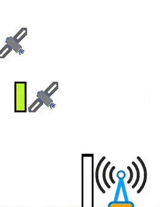
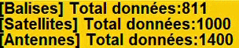

# Exercice Balises / Satellites
Valentin Gallo | Pierre Le Brun (Master TIIL-A)

## Correction du bogue :

### Problème constaté

Le problème qui intervient suite à l'exécution du programme concerne les balises qui peuvent
rester bloquées à la surface.

La balise effectue une réinitialisation de ses données pendant son déplacement ce qui...

### Correctif

Nous avons ajouté un boolean qui permet de savoir si la balise collecte des données.

```java
boolean isCollectingData = true;
```

Le boolean est défini à faux lorsque la mémoire de la balise est remplie.

```java
if(this.memoryFull()) {
    this.isCollectingData = false;
}
```

Le boolean est défini à vrai lorsque la balise est redescendue et est prête à collecter.

```java
public void bouge(Balise target) {
    Point p = target.getPosition();
    int y = p.y;
    if (y < this.profondeur) {
        y += 3;
        if (y > this.profondeur) y = this.profondeur;
        target.setPosition(new Point(p.x, y));
    }  else {
        target.isCollectingData =true;
        target.setDeplacement(next);
    }
}
```

## Ameliorations réalisées :

- ### Les balises collectaient trop de données

Nous avons remarqué que les balises récupéraient des données à chaque
tick même quand elle occupé à remonter à la surface (donc 350 dataSize /300 memorySize était possibles)
```java
public void tick() {
    if (isCollectingData) {
        this.readSensors();
        if(this.memoryFull()) {
            Deplacement redescendre = new Redescendre(this.deplacement(), this.profondeur());
            Deplacement deplSynchro = new DeplSynchronisation(redescendre);
            Deplacement nextDepl = new MonteSurfacePourSynchro(deplSynchro);
            this.setDeplacement(nextDepl);
            this.isCollectingData = false;
        }
    }
    super.tick();
}
```
_Corrigé en vérifiant si la balise collecte des données_

- ### Ajout d'indicateurs de progression


_Permet d'afficher le pourcentage de données collectées par un elementMobile_
_(une balise, un satellite, une antenne)._

- ### Ajout d'antennes



_Permet de récupérer les données d'un satellite lorsque celui passe au dessus._

- ### Ajout d'un compteur



_Affiche le nombre total de données récupéré par les balises, satellites et antennes._

- ### Création d'une java-doc

- ### Création d'un diagramme UML :

A regenerer

